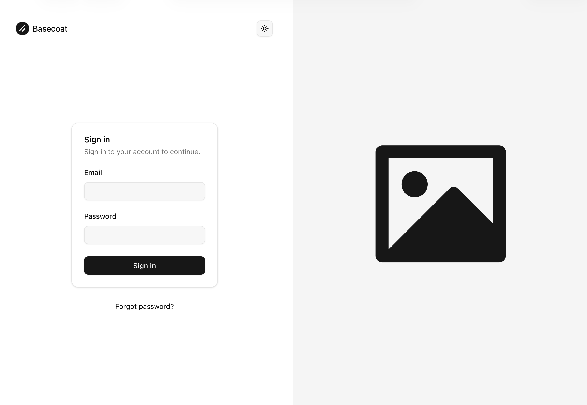
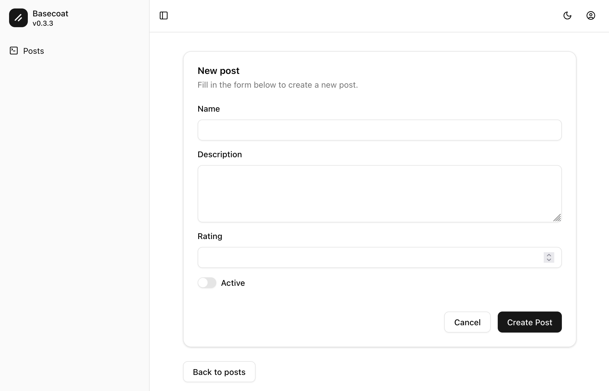

# Basecoat (shadcn) powered views for Rails

This gem provides you with amazing layouts, scaffolds, views and partials based on [Basecoat UI](https://basecoatui.com).
It is especially powerful for admin applications with a lot of CRUD actions.

Beautiful responsive, dark & light mode Rails scaffolds, pages for authentication and Devise, and pagy styling.






## Usage

From scratch:

    rails new myproject -c tailwind
    cd myproject
    bundle add basecoat
    rails basecoat:install
    rails g scaffold Post title:string! description:text posted_at:datetime active:boolean rating:integer 
    rails db:migrate
    ./bin/dev
    # visit http://localhost:3000/posts

**Note:** Basecoat requires Tailwind CSS. If you haven't installed it yet, follow the instructions at [https://github.com/rails/tailwindcss-rails](https://github.com/rails/tailwindcss-rails) to set up Tailwind CSS in your Rails application.

## Why?

The default scaffolds are ugly. There's no styling, no turbo frames - it doesn't represent the best practices.
It's missing the WOW factor.

Shadcn has quickly become the default ui for the web. However, sometimes we don't _really_ need all the React components.
Especially with backend applications - where Rails shines as full stack solution.

This is where basecoat-ui comes in. The reason why I love basecoat is because it combines tailwind with clean css classes (like daisy-ui).

If you need more complex components; enrich the views with https://railsblocks.com/ or https://shadcn.rails-components.com/ or just the shadcn React components themselves.

### Rake tasks

#### Layout (required)

```bash
rake basecoat:install
```
NB: This will overwrite exising files!

The generated views will include:
*  Basecoat CSS styling
*  Turbo Frame support for SPA-like navigation
*  A tiny bit of javascript for awesome view transitions
*  Responsive design
*  Dark mode support
*  Form validation with required fields
*  Boolean fields styled as switches
*  Automatic sidebar navigation links

The scaffold templates are automatically available from the gem, so you can immediately generate scaffolds.

#### Default Rails Authentication

Install the Basecoat-styled authentication views (for Rails built-in authentication):
    
    rails generate:authentication
    rails db:migrate
    rake basecoat:install:authentication

NB: To create a user, go to your console:
    
    rails console
    User.create(email_address: "email@example.com", password: "basecoat")
    exit

#### Install the Basecoat-styled Devise views and layout:

First install devise, follow the instructions at https://github.com/heartcombo/devise. Then:

```bash
rake basecoat:install:devise
```
NB: This will overwrite exising files!

#### Install Pagy Pagination Styles

Install the Basecoat-styled Pagy pagination:

```bash
rake basecoat:install:pagy
```

## Requirements

- Rails 8.0+
- Tailwind CSS ([installation instructions](https://github.com/rails/tailwindcss-rails))
- Basecoat CSS
- Stimulus (for the theme toggle, can be moved to something else if you desire...)

## Issues

* We include extra css for the definition list. Ideally I would pick an existing component.
* Rails adds class="field_with_errors", so we need extra css for this. I hope Rails will at some point have aria-invalid="true" on the input, basecoat will apply the correct styling.
* Can the views even be prettier? Probably! I'm more than happy to discuss improvements:

## Contributing

Bug reports and pull requests are more than welcome on GitHub!

## License

The gem is available as open source under the terms of the [MIT License](https://opensource.org/licenses/MIT).
