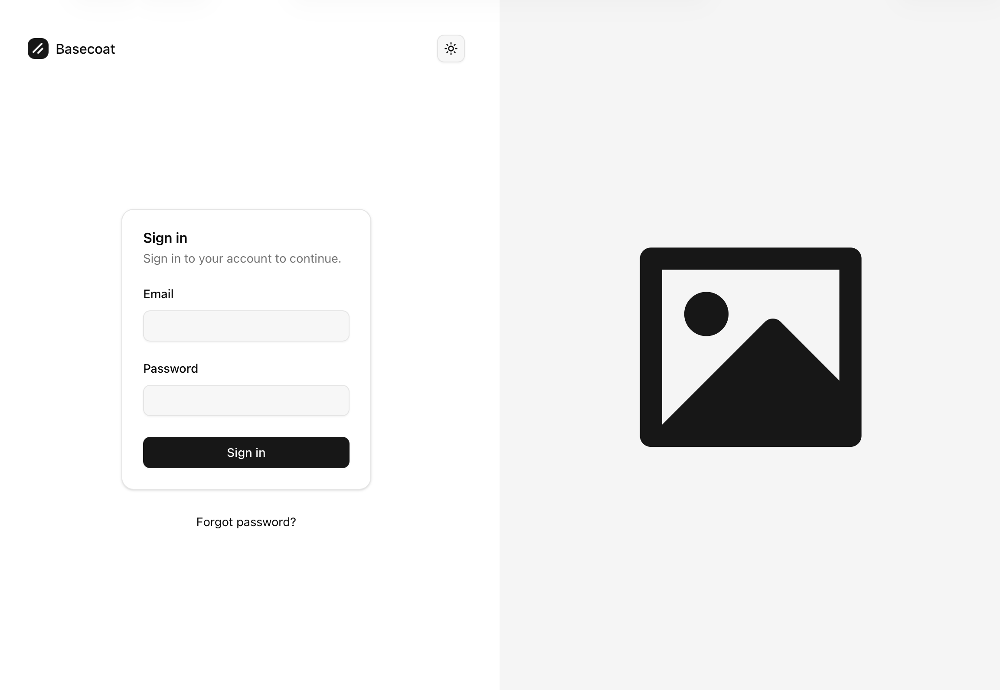
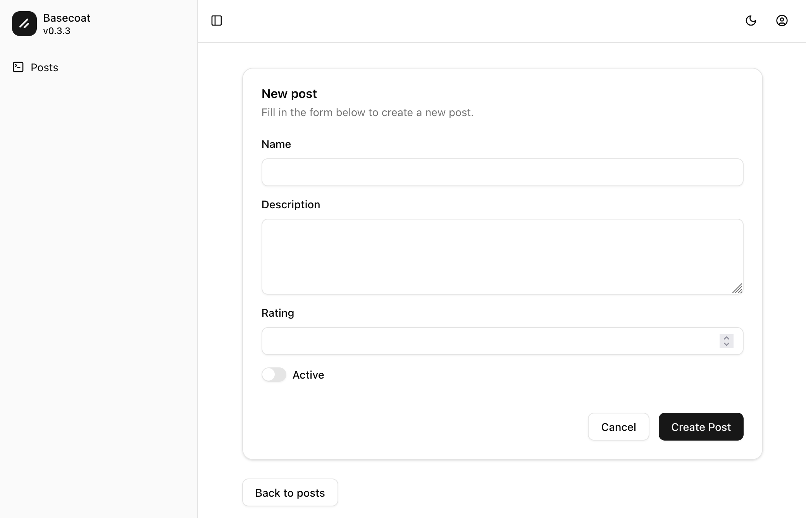

# Basecoat (shadcn) powered views for Rails

This gem provides you with amazing layouts, scaffolds, views and partials based on [Basecoat UI](https://basecoatui.com).
It is especially powerful for admin applications with a lot of CRUD actions.





## Usage

Try it from scratch:

    rails new myproject -c tailwind
    cd myproject
    yarn
    bundle add basecoat
    rails basecoat:install
    rails g scaffold Post title:string! description:text posted_at:datetime active:boolean rating:integer 
    rails db:migrate
    ./bin/dev
    # open http://localhost:3000/posts

**Note:** Basecoat requires Tailwind CSS. If you haven't installed it yet, follow the instructions at [https://github.com/rails/tailwindcss-rails](https://github.com/rails/tailwindcss-rails) to set up Tailwind CSS in your Rails application.

## Why?

The default scaffolds are ugly. There's no styling, no turbo frames - it's missing the WOW factor.

Basecoat CSS combines tailwind with clean css classes. It creates the looks of shadcn, which has a massive community.

If you need more complex components; enrich the views with https://railsblocks.com/ or https://shadcn.rails-components.com/ or just the shadcn React components themselves.

## Icons

Basecoat uses the [lucide-rails](https://github.com/heyvito/lucide-rails) gem for beautiful, consistent icons throughout the UI. The gem is automatically installed as a dependency.

You can use Lucide icons in your views with the `lucide_icon` helper:

```erb
<%= lucide_icon "home" %>
<%= lucide_icon "user", class: "w-5 h-5" %>
```

Browse available icons at [lucide.dev](https://lucide.dev/icons/).

### Using Different Icon Libraries

If you prefer to use a different icon library, you can switch to the [rails_icons](https://github.com/nejdetkadir/rails_icons) gem which supports multiple icon libraries including Lucide, Font Awesome, Heroicons, and more. Simply:

1. Add `rails_icons` to your Gemfile
2. Replace `lucide_icon` calls with `icon` calls from rails_icons in the generated views
3. Configure your preferred icon library in `config/initializers/rails_icons.rb`

## Form Helpers

Basecoat includes custom form helpers for enhanced UI components:

### Select Component

Use `basecoat_select` in forms or `basecoat_select_tag` outside of forms:

```erb
<%= form_for @user do |f| %>
  <%= f.basecoat_select :fruit, [["Apple", 1], ["Pear", 2]] %>
<% end %>

<%# Or without a form: %>
<%= basecoat_select_tag "fruit", [["Apple", 1], ["Pear", 2]] %>

<%# With options: %>
<%= f.basecoat_select :fruit, [["Apple", 1], ["Pear", 2]],
    group_label: "Fruits",
    placeholder: "Search fruits..." %>

<%# You can add a remote url, which does a turbo call %>
  <%= f.basecoat_select :fruit, [[]], url: "/fruits/search", turbo_frame: "custom_frame" %>

  `fruits/search.turbo_stream.erb` should then have the following content:

  <%= turbo_stream.update "custom_frame" do %>
    <% @fruits.each do |fruit| %>
      <%= tag.div fruit.name, role: "option", data: { value: fruit.id } %>
    <% end %>
  <% end %>

# If you don't add the turbo_frame option there's a fallback to underscored URL (_fruits_search)
<%= f.basecoat_select :fruit, [[]], url: "/fruits/search" %>

Make sure this matches the frame in your partial!
```

### Remote Search Component

Use `basecoat_remote_search_tag` for a standalone search component with Turbo Stream support:

```erb
<%# Basic usage: %>
<%= basecoat_remote_search_tag("/posts/search") %>

<%# With custom turbo frame name: %>
<%= basecoat_remote_search_tag("/posts/search", turbo_frame: "custom_frame") %>

<%# With custom placeholder: %>
<%= basecoat_remote_search_tag("/posts/search", placeholder: "Search posts...") %>
```

Your controller should respond with a Turbo Stream that updates the frame:

```ruby
# posts_controller.rb
def search
  @posts = Post.where("title LIKE ?", "%#{params[:query]}%")

  respond_to do |format|
    format.turbo_stream
  end
end
```

```erb
<%# posts/search.turbo_stream.erb %>
<%= turbo_stream.update "_posts_search" do %>
  <% @posts.each do |post| %>
    <%= link_to post.title, post_path(post), class: "block p-2 hover:bg-muted" %>
  <% end %>
<% end %>
```

Options:
- `url` (required): The URL to fetch search results from
- `turbo_frame`: Custom turbo frame name (defaults to underscored URL, e.g., `/posts/search` becomes `_posts_search`)
- `placeholder`: Custom placeholder text (defaults to "Type a command or search...")

### Country Select Component

Use `basecoat_country_select_tag` for a country picker with flag emojis:

```erb
<%# Basic usage (all countries): %>
<%= basecoat_country_select_tag :country %>

<%# With pre-selected country: %>
<%= basecoat_country_select_tag :country, selected: "US" %>

<%# With priority countries at the top: %>
<%= basecoat_country_select_tag :country, priority: ["US", "CA", "GB"] %>

<%# Only show specific countries: %>
<%= basecoat_country_select_tag :country, countries: ["US", "CA", "MX"] %>

<%# Exclude specific countries: %>
<%= basecoat_country_select_tag :country, except: ["KP", "IR"] %>

<%# In a form: %>
<%= form_for @user do |f| %>
  <%= f.label :country %>
  <%= f.basecoat_country_select :country %>
<% end %>
```

Options:
- `selected`: Pre-select a country by its ISO 3166-1 alpha-2 code (e.g., "US")
- `priority`: Array of country codes to show at the top of the list
- `countries`: Array of country codes to include (shows only these countries)
- `except`: Array of country codes to exclude
- All `basecoat_select_tag` options (placeholder, scrollable, etc.)

**Note:** This helper requires the `countries` gem.

## Rake tasks

### Layout (required)

```bash
rake basecoat:install
```
NB: Only run this once.

The generated views will include:
*  Basecoat CSS styling
*  Turbo Frame support for SPA-like navigation
*  A tiny bit of javascript for awesome view transitions
*  Responsive design
*  Dark mode support
*  Form validation with required fields
*  Boolean fields styled as switches
*  Automatic sidebar navigation links

The scaffold templates are automatically available from the gem, so you can immediately generate scaffolds.

### Default Rails Authentication

Install the Basecoat-styled authentication views (for Rails built-in authentication):
    
    rails generate authentication
    rails db:migrate
    rake basecoat:install:authentication

NB: To create a user, go to your console:
    
    rails console
    User.create(email_address: "email@example.com", password: "basecoat")
    exit

### Install the Basecoat-styled Devise views and layout:

First install devise, follow the instructions at https://github.com/heartcombo/devise. Then:

```bash
rake basecoat:install:devise
```

### Install Pagy Pagination Styles

Install the Basecoat-styled Pagy pagination:

```bash
rake basecoat:install:pagy
```

## Requirements

- Rails 8.0+
- Tailwind CSS ([installation instructions](https://github.com/rails/tailwindcss-rails))
- Basecoat CSS
- Stimulus (for the theme toggle, can be moved to something else if you desire...)

## Issues

* We include extra css for the definition list. Ideally I would pick an existing component.
* Rails adds class="field_with_errors", so we need extra css for this. I hope Rails will at some point have aria-invalid="true" on the input, basecoat will apply the correct styling.
* Can the views even be prettier? Probably! I'm more than happy to discuss improvements:

## Contributing

Bug reports and pull requests are more than welcome on GitHub!

## License

The gem is available as open source under the terms of the [MIT License](https://opensource.org/licenses/MIT).
